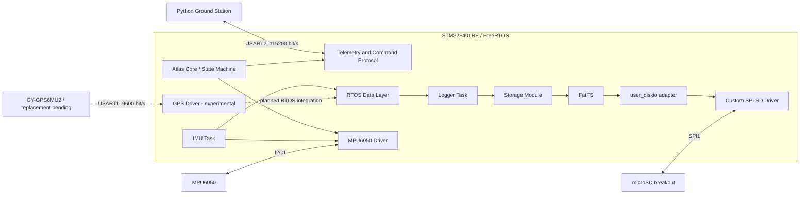

# ATLAS Mission Computer

**Embedded sensing, telemetry, and data-logging prototype based on the STM32F401RE**

ATLAS is an engineering prototype developed to study the design of a small embedded mission computer rather than a collection of isolated peripheral demonstrations. The current implementation acquires inertial data from an MPU6050, estimates roll and pitch, accepts commands from a desktop ground station, and records timestamped orientation data to a microSD card under FreeRTOS.

> **Project status:** functional laboratory prototype. ATLAS has not been designed, verified, or qualified for flight, safety-critical control, or unattended field deployment.

## 1. Current revision

**Firmware revision:** v0.8 development branch

| Subsystem | State | Verification performed |
|---|---|---|
| STM32F401RE platform | Operational | Build, program, boot, and peripheral initialization verified |
| MPU6050 interface | Operational | I2C communication, wake-up, raw acceleration, and repeated sampling verified |
| Roll and pitch estimation | Operational with limitations | Static and low-dynamic tilt response verified against manual motion |
| IMU calibration | Operational | Button- and command-triggered offset calculation verified |
| USART2 telemetry | Operational | Status, orientation, calibration output, and command responses verified |
| Desktop ground station | Operational | Connection, console, command transmission, and 3D orientation display verified |
| FreeRTOS integration | Operational | Scheduler and three application tasks verified |
| microSD / FatFS | Operational | Card initialization, filesystem mount, file creation, batched writes, and periodic sync verified |
| CSV mission logging | Operational | Timestamped roll/pitch records written through an RTOS message queue |
| Queue overflow monitoring | Operational | Drop counter implemented; startup drops eliminated using logger-ready gating |
| GPS interface | Experimental / blocked | USART1 configured; the tested GY-GPS6MU2 produced a continuously low TX line and no valid NMEA data |

## 2. System architecture



The architecture is intentionally layered:

1. CubeMX-generated code initializes the MCU, clocks, GPIO, and peripheral handles.
2. Driver modules implement device-specific communication.
3. service modules implement telemetry, storage, protocol parsing, and shared RTOS data.
4. tasks define execution timing and ownership of asynchronous work.
5. Atlas Core coordinates mission state and user commands.

## 3. Hardware configuration

### 3.1 Main controller

- STMicroelectronics NUCLEO-F401RE
- STM32F401RE, ARM Cortex-M4F
- ST-LINK virtual COM port used for the desktop link

### 3.2 MPU6050 inertial sensor

- Interface: I2C1 at 100 kHz
- Address: `0x68` in the current configuration
- Accelerometer range used by the conversion code: +/-2 g
- Scale factor: 16384 LSB/g
- Data used: three-axis accelerometer output
- Gyroscope fusion: not yet implemented

### 3.3 microSD storage

The tested breakout is connected over SPI1:

| microSD signal | Nucleo connector label |
|---|---|
| SCK | D13 |
| MISO | D12 |
| MOSI | D11 |
| CS | D10 / `SD_CS` |
| GND | GND |
| VCC | 5 V for the tested regulated breakout |

SPI starts with a conservative prescaler of 256 during development. The onboard LD2 function was relinquished because PA5/D13 is used as the SPI1 clock.

### 3.4 GPS development interface

- USART1 configured for asynchronous operation
- 9600 bit/s, 8 data bits, no parity, 1 stop bit
- Initial test module: GY-GPS6MU2
- Result: module power-on LED activity was observed, but its TX line forced the MCU input low and produced repeated `0x00` bytes
- Current conclusion: STM32 receive-path behavior was normal when the GPS TX wire was removed; the tested GPS hardware remains suspect

A u-blox NEO-M8N UART breakout is the planned replacement.

## 4. Firmware structure

```text
Core/
├── Inc/
│   ├── atlas.h
│   ├── gps.h
│   ├── imu.h
│   ├── protocol.h
│   ├── rtos_data.h
│   ├── sd_spi.h
│   ├── storage.h
│   └── telemetry.h
└── Src/
    ├── atlas.c
    ├── gps.c
    ├── imu.c
    ├── main.c
    ├── protocol.c
    ├── rtos_data.c
    ├── sd_spi.c
    ├── storage.c
    └── telemetry.c

FATFS/
└── Target/
    └── user_diskio.c
```

### Module responsibilities

| Module | Responsibility |
|---|---|
| `atlas.c/.h` | State machine, command response, calibration coordination, and mission-level control |
| `imu.c/.h` | MPU6050 wake-up, register reads, offset calibration, unit conversion, and roll/pitch calculation |
| `protocol.c/.h` | Interrupt-driven USART2 receive path and ASCII command parsing |
| `telemetry.c/.h` | Text telemetry formatting, UART transmission, and RTOS mutex protection |
| `rtos_data.c/.h` | Protected latest-IMU snapshot, logging queue, logger-ready flag, and queue-drop accounting |
| `storage.c/.h` | FatFS mount, log-file management, buffered writes, sync operations, and filesystem status |
| `sd_spi.c/.h` | SD-card SPI command layer, block reads/writes, card initialization, and geometry queries |
| `user_diskio.c` | Thin FatFS adapter that forwards requests to `sd_spi.c` |
| `gps.c/.h` | Preliminary USART line-read interface; not yet part of a validated GPS task |
| `main.c` | CubeMX initialization and generated RTOS task entry points |

The SD implementation was deliberately moved out of `user_diskio.c`. CubeMX regenerates that file, so keeping the complete low-level driver there repeatedly destroyed working code. The generated file now contains only forwarding calls inside preserved user-code sections; the maintained implementation is in `sd_spi.c`.

## 5. FreeRTOS execution model

| Task | CMSIS-RTOS priority | Allocated stack | Nominal behavior |
|---|---:|---:|---|
| `AtlasTask` | Normal | 2048 bytes | Runs Atlas Core, command handling, calibration requests, and current orientation telemetry; nominal delay 100 ms |
| `IMUTask` | Above normal | 1024 bytes | Reads the IMU every 10 ms, updates the shared snapshot, and publishes log packets |
| `LoggerTask` | Low | 2048 bytes | Owns FatFS after scheduler start, drains the log queue, batches CSV records, writes to microSD, and synchronizes periodically |

### Inter-task communication

The IMU task publishes each valid sample through two paths:

- a mutex-protected latest-value snapshot intended for low-rate consumers;
- an RTOS message queue for ordered logging.

The logging producer is disabled until `LoggerTask` has mounted the filesystem and opened the file. This prevents the queue from filling during slow SD-card startup. Queue insertion failures increment a drop counter; loss is therefore measurable rather than silent.

### Resource synchronization

- Telemetry transmission is protected by a CMSIS-RTOS mutex.
- The latest IMU snapshot is protected by a separate mutex.
- `LoggerTask` is the intended sole owner of FatFS and the open log file.
- Blocking `HAL_Delay()` was removed from the normal periodic Atlas task path after it starved the low-priority logger and caused UART timeouts. Periodic task timing uses `osDelay()`.

## 6. Orientation and calibration

The current orientation estimate is accelerometer-only:

```text
roll  = atan2(ay, az)
pitch = atan2(-ax, sqrt(ay^2 + az^2))
```

The result is converted to degrees and transmitted as integer values.

Calibration averages 500 accelerometer samples with a 5 ms spacing. The X and Y means are treated as zero-g offsets. The Z offset is calculated relative to +1 g:

```text
x_offset = mean(ax)
y_offset = mean(ay)
z_offset = mean(az) - 16384
```

This procedure assumes the unit is stationary, level, and oriented with +Z aligned with gravity. Calibration values are currently stored only in RAM and are lost after reset.

Because no gyroscope fusion is used, the estimate is suitable primarily for static or low-dynamic tilt. Linear acceleration, vibration, and rapid motion are interpreted as changes in gravity direction. Yaw is not observable from the accelerometer.

## 7. Telemetry and command interface

### 7.1 Physical link

- Peripheral: USART2
- Baud rate: 115200 bit/s
- Format: 8-N-1
- Transport: ST-LINK virtual COM port
- Payload: line-oriented ASCII

### 7.2 Implemented commands

| Command | Response / action |
|---|---|
| `PING` | Returns `PONG` |
| `CALIBRATE` | Requests IMU calibration |

The Nucleo user button also requests calibration.

### 7.3 Representative messages

```text
ATLAS v0.8 | Mission Computer
--------------------------------
IMU: ONLINE
Press B1 or send CALIBRATE
STORAGE: ONLINE
LOGGER: ONLINE
```

```text
ROLL:-12 PITCH:5
```

```text
CALIBRATION STARTED
CALIBRATION COMPLETE X:-103 Y:56 Z:318
```

The protocol is currently human-readable for development. It has no checksum, sequence number, length field, or formal version negotiation.

## 8. Mission logging

`LoggerTask` writes to:

```text
MISSION.CSV
```

Current schema:

```csv
time_ms,roll_deg,pitch_deg
10432,2,-5
10442,2,-5
10452,3,-4
```

`time_ms` is the STM32 millisecond uptime counter, not absolute UTC. Roll and pitch are currently logged as integer degrees.

### Write strategy

- The file is opened once and kept open.
- Multiple CSV rows are formatted into a RAM batch buffer.
- A batch is written when it approaches the configured threshold.
- Remaining buffered data is written before the periodic sync.
- `f_sync()` is called approximately once per second.

This strategy replaced an earlier open/write/close-per-sample implementation. The earlier design was too expensive at the IMU production rate and caused queue overflow. Batching, periodic sync, and logger-ready gating removed the observed startup drops during testing.

### Data-integrity implications

A sudden power loss may discard the most recent unsynchronized data and can still damage the open filesystem. A production revision requires an explicit shutdown path, card-removal handling, and power-fail strategy.

The current development build may format a card when FatFS reports no recognized filesystem. This behavior is convenient for a dedicated test card but is unsafe for deployment and should be replaced by an explicit operator command.

## 9. Desktop ground station

The Python ground station uses Tkinter and PySerial. It provides:

- serial-port selection and connect/disconnect control;
- a live telemetry console;
- `PING` and `CALIBRATE` command buttons;
- roll and pitch display;
- a software-rendered 3D cube driven by orientation telemetry;
- basic IMU online/offline indication.

Install the runtime dependency:

```powershell
py -m pip install pyserial
```

Run the application:

```powershell
py atlas_ground_station.py
```

Select the Nucleo virtual COM port and 115200 bit/s. Close PuTTY or any other application that already owns the same COM port.

## 10. Building and programming

### Requirements

- STM32CubeIDE 2.2.0 or a compatible release
- STM32CubeMX integration and STM32F4 HAL package
- NUCLEO-F401RE connected through ST-LINK
- Python 3 with PySerial for the ground station

### Procedure

1. Open the project in STM32CubeIDE.
2. Confirm that **Keep User Code when re-generating** is enabled in CubeMX.
3. Regenerate code only when peripheral settings change.
4. Confirm that `Core/Src/sd_spi.c` and `Core/Inc/sd_spi.h` remain present.
5. Clean the project.
6. Build the selected configuration.
7. Program and run the target.
8. Open the ground station and connect to the USART2 virtual COM port.

A clean development build was observed with zero compiler errors and zero warnings.

## 11. Validation performed

| Test | Result |
|---|---|
| STM32 project generation, build, and programming | Pass |
| GPIO heartbeat and user-button input | Pass during early bring-up |
| MPU6050 I2C detection and register access | Pass |
| Repeated accelerometer acquisition | Pass |
| Roll and pitch response to manual rotation | Pass for low-dynamic motion |
| USART2 text telemetry | Pass |
| Interrupt-driven command reception | Pass |
| `PING` / `PONG` exchange | Pass |
| Button- and PC-triggered calibration | Pass |
| Python ground-station display and 3D cube | Pass |
| SPI SD-card initialization | Pass after correcting breakout supply voltage |
| FatFS mount and filesystem creation | Pass |
| Persistent CSV logging | Pass |
| Logger queue-drop detection | Pass |
| Batch-write throughput correction | Pass; no new drops observed after readiness gating |
| CubeMX regeneration with custom SD driver preserved | Pass after moving implementation to `sd_spi.c` |
| GPS raw NMEA reception | Fail with tested GY-GPS6MU2; hardware TX line suspected |

## 12. Engineering issues resolved during development

The following failures materially influenced the current design:

1. **Polling USART reception lost command bytes.** The command path was moved to interrupt-driven, byte-wise reception.
2. **Application logic accumulated in `main.c`.** IMU, telemetry, protocol, storage, and Atlas Core were separated into modules with public headers and private implementation state.
3. **CubeMX overwrote the SPI SD driver.** The driver was moved to a non-generated module and `user_diskio.c` was reduced to a preserved adapter.
4. **The SD breakout failed at 3.3 V input.** The tested board required 5 V at its regulated VCC input.
5. **FatFS initially reported `FR_NOT_READY`, `FR_NO_FILESYSTEM`, and `FR_DISK_ERR`.** Debug stages were added to separate card-handshake failures from filesystem and disk-geometry failures. Missing status, read, write, and ioctl implementations were completed.
6. **Higher-priority task blocking starved the logger.** A periodic `HAL_Delay()` inside the Atlas task was replaced by RTOS-aware delays.
7. **Multiple tasks attempted UART output concurrently.** Telemetry transmission was serialized with a mutex and a common transmit path.
8. **The logger dropped samples during SD startup.** Queue production now begins only after the logger reports readiness.
9. **Per-sample filesystem writes were too expensive.** The logger now batches rows and synchronizes at a controlled interval.
10. **The first GPS module produced a low-level UART fault.** Disconnect testing isolated the issue to the module/output side rather than the STM32 receive path.

These are retained in the documentation because they describe the engineering work required to reach the current state, not just the final feature list.

## 13. Known limitations and technical debt

1. **IMU ownership is not fully consolidated.** `IMUTask` samples for shared data and logging, while Atlas Core still performs an additional IMU read for orientation telemetry. The intended design is a single IMU owner with all consumers reading a protected snapshot or queue.
2. **Calibration is blocking.** The 500-sample calibration routine occupies the calling context for approximately 2.5 seconds.
3. **Calibration is volatile.** Offsets are not stored in flash or another non-volatile medium.
4. **Orientation is accelerometer-only.** There is no gyroscope fusion, dynamic attitude estimator, or yaw estimate.
5. **The shared telemetry formatting buffer is not designed for unrestricted multi-task formatting.** Transmission is mutex-protected, but future telemetry producers should use task-local buffers or hold the lock through formatting and transmission.
6. **Logger task code remains in generated `main.c`.** It should be moved into a dedicated `logger.c/.h` module.
7. **No safe shutdown protocol exists.** The open log file is synchronized periodically but not explicitly closed before arbitrary power removal.
8. **Automatic formatting is unsuitable for valuable data.** It must be replaced by an explicit authenticated/confirmed command.
9. **No watchdog or reset-recovery policy is active.**
10. **No stack high-water, heap, CPU-load, or task-aliveness monitoring is implemented.**
11. **The serial protocol lacks framing and integrity protection.**
12. **The timestamp is uptime only and wraps with the HAL tick counter.**
13. **GPS support is not validated.**
14. **No environmental, vibration, thermal, EMI/EMC, or long-duration testing has been performed.**

## 14. Planned work

Priority order for the next revisions:

1. Replace the failed GPS hardware with a known u-blox NEO-M8N UART breakout and validate raw NMEA reception.
2. Implement a non-blocking GPS task and NMEA parser for fix validity, UTC time, latitude, longitude, speed, and satellite count.
3. Add GPS fields and fix-validity flags to the log schema.
4. Consolidate MPU6050 ownership under `IMUTask`; make telemetry consume the latest protected snapshot.
5. Move `LoggerTask` and its policy out of generated `main.c`.
6. Add a health-monitor task with stack high-water marks, heap status, queue depth, sensor liveness, storage status, and error counters.
7. Replace development auto-format behavior with an explicit ground-station command.
8. Add clean mission-start, mission-stop, sync, close, and shutdown sequences.
9. Add gyroscope acquisition and a complementary or quaternion-based attitude estimator.
10. Define a versioned packet protocol with framing, sequence numbers, and integrity checking.
11. Add watchdog supervision and fault-event logging.
12. Create a custom PCB and controlled power architecture after firmware interfaces stabilize.

## 15. Development history

| Revision | Main result |
|---|---|
| v0.1 | STM32 project creation, LED heartbeat, and GPIO input/output |
| v0.2 | MPU6050 I2C bring-up and device identification |
| v0.3 | Accelerometer conversion and USART telemetry |
| v0.4 | Roll and pitch estimation |
| v0.5 | Interactive calibration and desktop ground station |
| v0.6 | IMU, telemetry, and protocol modularization |
| v0.7 | Atlas Core state machine and cleaner application boundary |
| v0.8 | FreeRTOS integration, SPI microSD driver, FatFS, queued and batched CSV logging |
| Experimental | USART1 GPS interface and hardware fault investigation |

## 16. License and authorship

Developed by **Abdulaziz** as an independent embedded-systems portfolio project.

**All rights reserved**.
